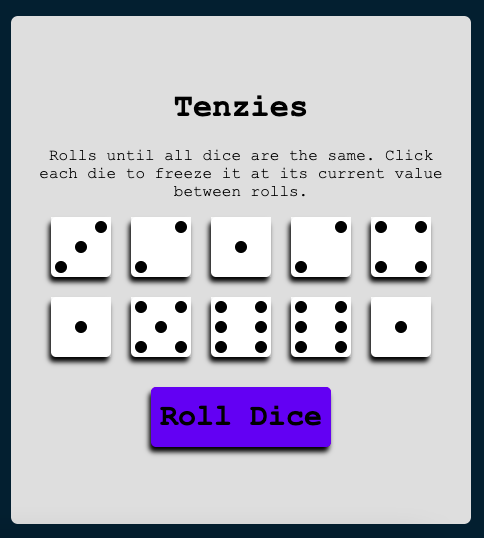
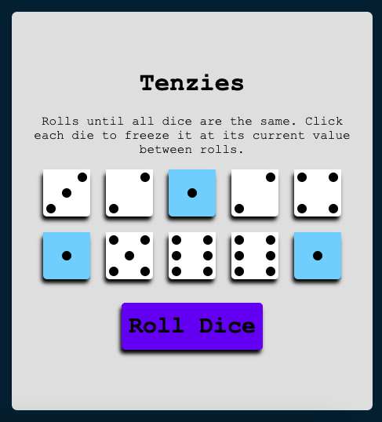
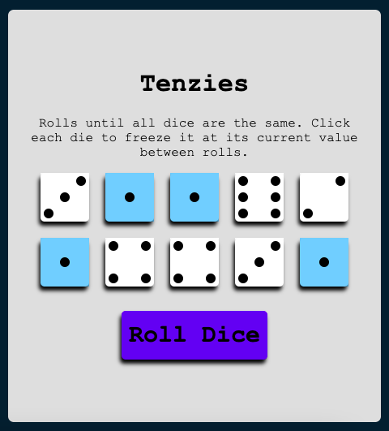
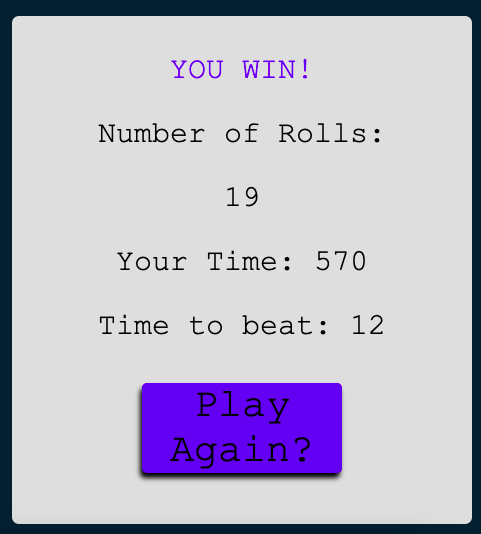

# tenzies
Rolling dice game for show casing some Javascript React framework elements

## Start Screen
When you first open the page, you will instantly be prompted with the game. 

The instructions are for how to play the simple game of "tenzies."

To play the game, you can click on the different dice that you dont want to re roll. After your selections have been made, you can click the "Roll Dice" button to re roll all unfrozen dice.

 
 Keep rolling until you match all ten dice with the same face.

 

 Finally you will be greeted with a win screen that shows you how many re rolls you had to do, and the time in seconds that it took you to get to the end.

 

 The time you take is compared to a best time and save the quickest time locally with "localstorage" in React. This allows for the same player or a different player to play again, and try to race for a better time.

### Sources
A lot of the material and inspieration covered in this project was learned from freeCodeCamp.org

Video with a large amount of the material: https://youtu.be/bMknfKXIFA8
